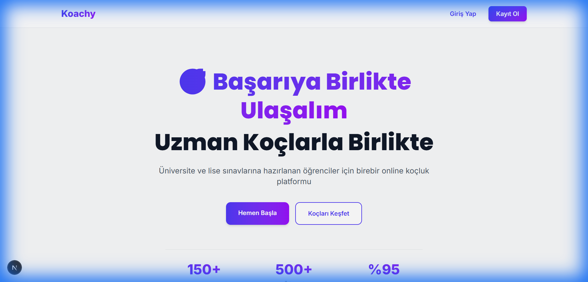
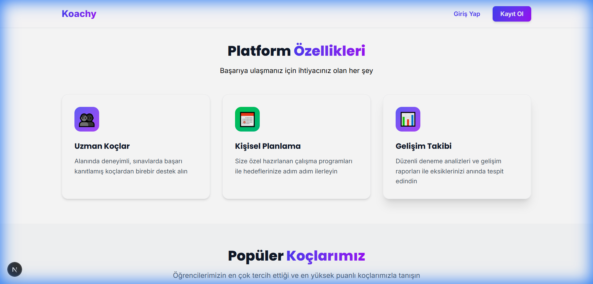
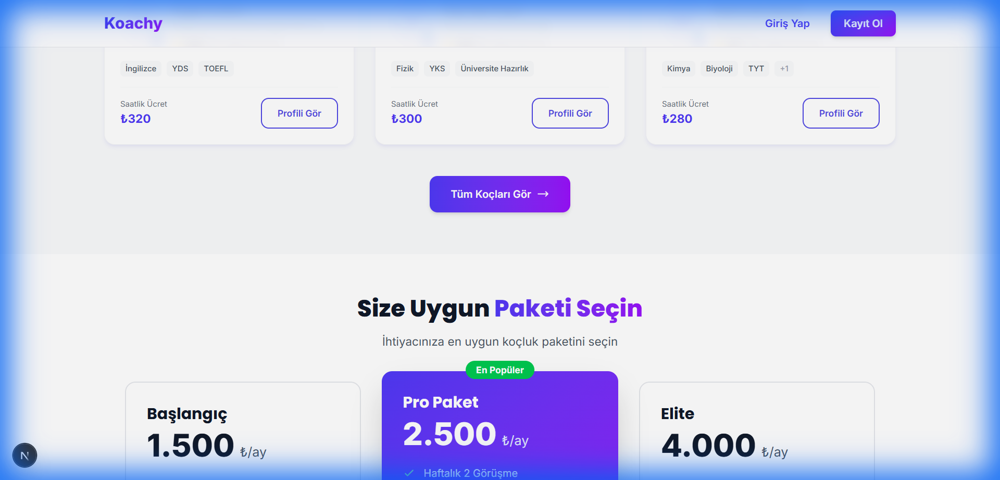
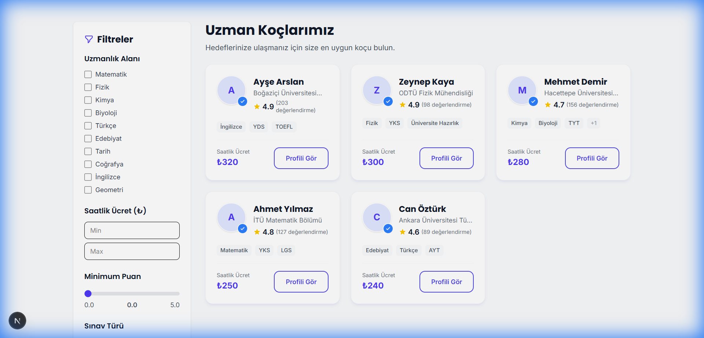
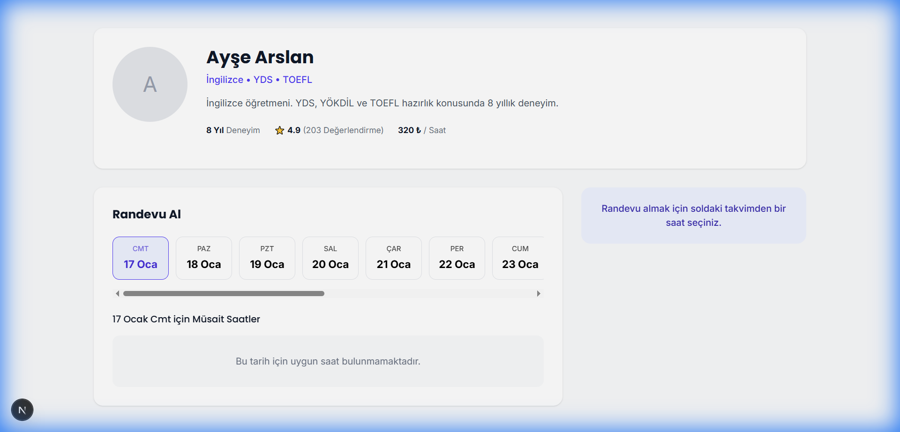
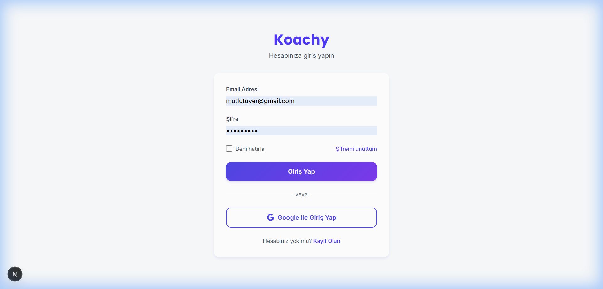
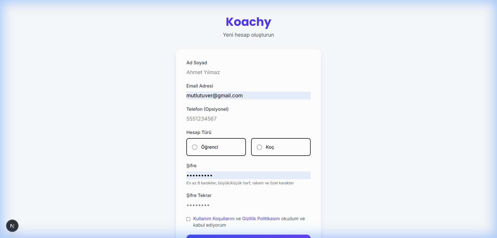
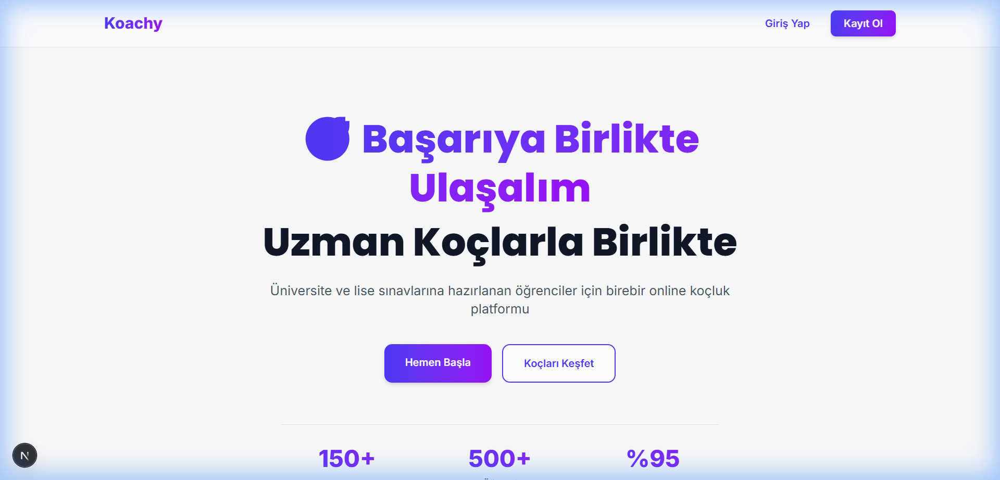

# 🎓 Koachy - Online Coaching Platform

A modern web platform that provides one-on-one online coaching for students preparing for university and high school entrance exams, featuring expert coach matching and progress tracking.

> **[🇹🇷 Türkçe README için tıklayın](README.tr.md)**

## ✨ Features

- 🎯 **Student-Coach Matching**: Advanced filtering by subject, experience, and rating
- 📅 **Smart Appointment System**: Conflict prevention algorithm with real-time availability
- 💬 **Real-time Messaging**: Firebase Realtime Database integration
- 📚 **Study Materials & Reports**: PDF/Video sharing and progress tracking
- 💳 **Secure Payment**: Stripe and Iyzico integration
- 🎨 **Dynamic CMS**: Homepage management from admin panel
- 🔐 **Enterprise-level Security**: XSS, Injection protection, RBAC

## 📸 Screenshots

Live functionality showcase of the platform:


*Modern and attractive design welcoming students with stats showing 150+ expert coaches, 500+ students, and 95% success rate*


*Core features presentation: Expert coaches, personal planning, and progress tracking*


*Starter (1,500₺), Pro (2,500₺), and Elite (4,000₺) packages with coach profiles*


*Advanced filtering system with detailed coach information cards*


*Ayşe Arslan's profile - 8 years experience, 4.9 rating, with appointment booking system*


*Email/password login and Google sign-in options*


*Sign up form for Student or Coach roles*


*Comprehensive homepage showcasing all platform sections*

> [!NOTE]
> These screenshots were taken from the **live, fully functional** platform. All features are active and operational.

## 🛠️ Technology Stack

- **Frontend**: Next.js 14+ (App Router), React 18+, TypeScript
- **Styling**: Tailwind CSS, Custom Design System
- **Backend**: Firebase (Auth, Firestore, Functions, Storage)
- **Payment**: Stripe API
- **Testing**: Playwright (E2E), Vitest (Unit)
- **Deployment**: Vercel

## 🚀 Installation

### Prerequisites

- Node.js >= 18.0.0
- npm >= 9.0.0
- Firebase account
- Stripe account (Test/Production)

### Steps

1. **Clone the repository**
   ```bash
   git clone https://github.com/MUTLU234/Koachy_Online_Web_Site.git
   cd Koachy_Online_Web_Site
   ```

2. **Install dependencies**
   ```bash
   npm install
   ```

3. **Set up environment variables**
   ```bash
   cp .env.example .env.local
   ```
   
   Open `.env.local` and add your API keys:
   - Firebase credentials
   - Stripe keys
   - NextAuth secret

4. **Start the development server**
   ```bash
   npm run dev
   ```
   
   The application will be running at [http://localhost:3000](http://localhost:3000).

## 📁 Project Structure

```
Koachy_Online_Web_Site/
├── src/
│   ├── app/                    # Next.js App Router
│   │   ├── (auth)/            # Auth pages
│   │   ├── (dashboard)/       # Dashboard pages
│   │   └── (public)/          # Public pages
│   ├── components/            # Shared components
│   ├── lib/                   # Utilities & Firebase config
│   ├── hooks/                 # Custom hooks
│   └── types/                 # TypeScript types
├── firebase/                  # Firebase config
├── tests/                     # Test files
└── images/                    # Screenshots
```

## 🔐 Security

- ✅ Input Validation (Zod)
- ✅ XSS Protection
- ✅ SQL/NoSQL Injection Prevention
- ✅ CSRF Protection
- ✅ Rate Limiting
- ✅ RBAC (Role-Based Access Control)
- ✅ Firebase Security Rules

## 👨‍💻 Author

**Nurettin Mutlu Tüver**

- LinkedIn: [linkedin.com/in/nurettin-mutlu-tüver](https://www.linkedin.com/in/nurettin-mutlu-tüver)
- GitHub: [@MUTLU234](https://github.com/MUTLU234)

## 📞 Contact

For questions or collaboration opportunities, feel free to reach out via LinkedIn or GitHub.

---

⭐ If you found this project helpful, please consider giving it a star!